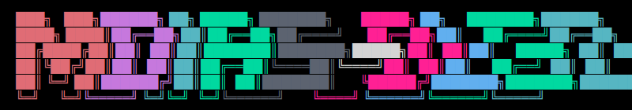
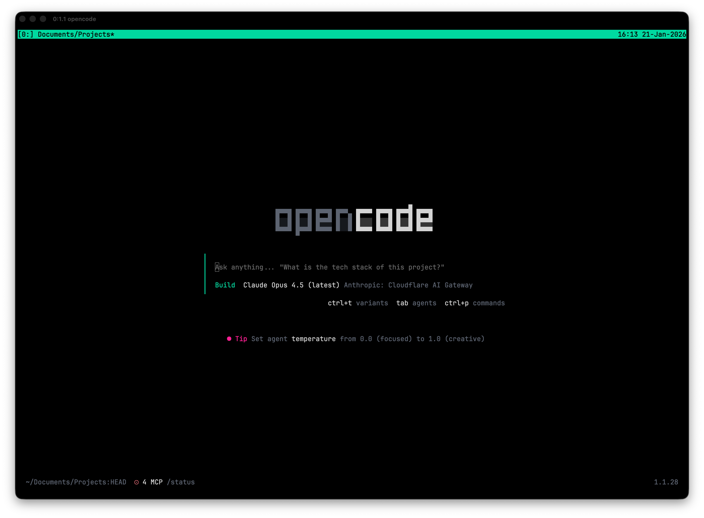
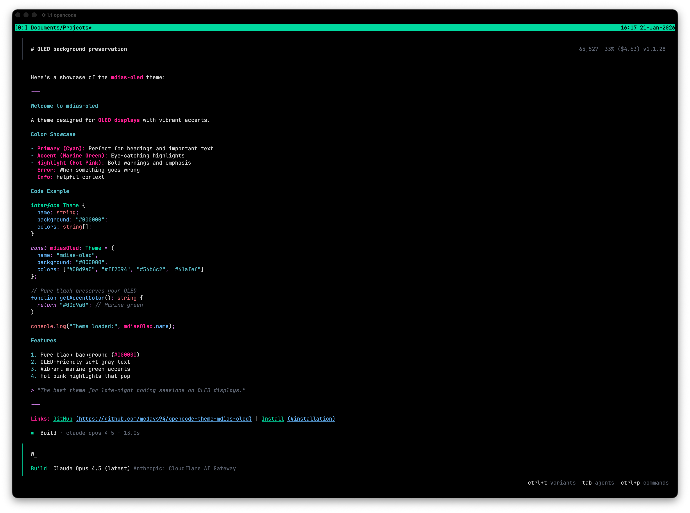

# mdias-oled



A vibrant OLED-friendly theme for [OpenCode](https://opencode.ai) with pure black background, marine green accents, and hot pink highlights. Inspired by **vaporwave** aesthetics.

## Screenshots





## Color Palette

| Role | Color | Hex |
|------|-------|-----|
| Background |  | `#000000` |
| Text |  | `#d4d4d4` |
| Primary |  | `#56b6c2` |
| Accent |  | `#00d9a0` |
| Highlight |  | `#ff2094` |
| Error |  | `#e06c75` |
| Blue |  | `#61afef` |
| Magenta |  | `#c678dd` |

## Features

- **Pure black background** (`#000000`) - Perfect for OLED displays, saves battery and prevents burn-in
- **OLED-friendly text** - Soft gray (`#d4d4d4`) instead of harsh white to reduce eye strain
- **Vibrant marine green** - Eye-catching accent color that pops on black
- **Hot pink highlights** - Bold accent for warnings and emphasis

## Installation

```bash
cd ~/.config/opencode
npm install mcdays94/opencode-theme-mdias-oled
```

Then add to your `opencode.jsonc`:

```json
{
  "theme": "mdias_oled"
}
```
Or just prompt opencode to fetch the theme from this repo.

## Inspiration

This theme draws inspiration from **vaporwave** aesthetics - combining neon cyans and hot pinks against pure black, evoking late-night coding sessions and retro-futuristic vibes.

## License

MIT
